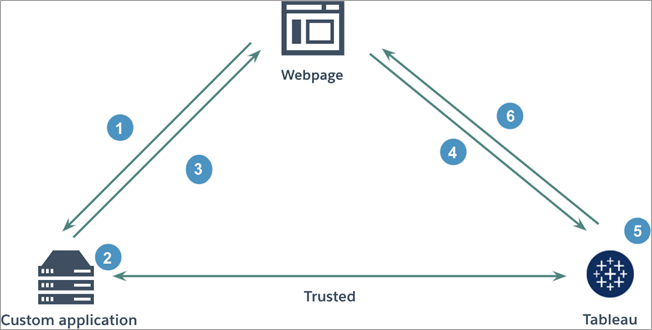

# Tableau Connected Apps

A collection of [Tableau Connected Apps](https://www.tableau.com/about/blog/2022/1/how-seamlessly-integrate-analytics-your-product-connected-apps) code samples. Connected Apps is the latest [JWT](https://jwt.io/) authentication and SSO method available on the Tableau platform. Authentication via this method is supported for both Tableau's [REST API](https://help.tableau.com/current/api/rest_api/en-us/REST/rest_api.htm) and for displaying visualizations using the [Embedding API v3](https://help.tableau.com/current/api/embedding_api/en-us/index.html). To understand how these APIs and Connected Apps work together to extend the Tableau platform and add analytical capabilities to your application, refer to the [Embedded Analytics Playbook](https://tableau.github.io/embedding-playbook/).


</br>

## Table of Contents
- [Tableau Connected Apps](#tableau-connected-apps)
  - [Table of Contents](#table-of-contents)
  - [Connected Apps](#connected-apps)
  - [Requirements](#requirements)
  - [Installation](#installation)
  - [Dependencies](#dependencies)
  - [Environment Variables](#environment-variables)

</br>

## Connected Apps

Tableau Connected Apps enable a seamless and secure authentication experience by facilitating an explicit trust relationship between your Tableau environment and custom applications that embed Tableau content or make use of Tableau's REST API. For a detailed explanation and setup instructions, refer to the [official documentation](https://help.tableau.com/current/online/en-us/connected_apps.htm).

The diagram below illustrates how authentication works between custom applications and a Connected App.



1. User visits the webpage
2. Custom application constructs an authentication token
3. Custom application responds with authentication token
4. Webpage requests content from Tableau
5. Tableau validates the token
6. Tableau returns the content based on the restricted embedding context

A similar flow takes place when Connected Apps are used to authenticate into Tableau's REST API. In this case, successful authentication will return an API token that must be added to subsequent requests via an `X-Tableau-Auth` header.

</br>

## Requirements

This list covers requirements for local development and deployment to Heroku (note that you are free to deploy this server on other platforms).

- [Python](https://www.python.org/) version 3.8.8
- [Anaconda](https://www.anaconda.com/) or some other Python environment manager (optional but recommended)
- Tableau Server or Tableau Online site (a developer site is available for free by signing up for the [developer program](https://www.tableau.com/developer))

</br>

## Installation

1. Clone this repository
```bash
git clone git@github.com:stephenlprice/tableau-connected-apps.git
# or
git clone https://github.com/stephenlprice/tableau-connected-apps.git

# navigate inside the project directory
cd tableau-connected-apps
```
1. Create a `conda` environment to install all dependencies and activate it (see [Dependencies](#dependencies) for more info.)
```bash
# will create an environment called tableau-webhooks
conda env create -f environment.yml

# activates the environment
conda activate tableau-connected-apps
```
> ##### *__NOTE__: if you are not using `conda` you can create a `requirements.txt` file or install the dependencies listed in the `environment.yml` file manually with `pip3`.*
</br>

3. Create a `.env` file in the project's root directory and add values for each environment variable described in the [example file](#environment-variables) (`example-env`)
```bash
# create the .env file
touch .env
```
> ##### *__NOTE__: the script will raise a `RuntimeError` if these environment variables are not declared.*
</br>

4. Run the script
```bash
# enter the repo's python folder
cd python
# run the script
python index.py
```

</br>

## Dependencies

This project was built with [Anaconda](https://www.anaconda.com/), therefore the development environment can be cloned from the `environment.yml` file. Most dependencies are installed with `conda` while the last three are installed with `pip3`. 

If you are new to `conda` I recommend keeping the [conda cheatsheet](https://docs.conda.io/projects/conda/en/4.6.0/_downloads/52a95608c49671267e40c689e0bc00ca/conda-cheatsheet.pdf) nearby for reference.

```yaml
name: tableau-connected-apps
channels:
  - defaults
dependencies:
  - python=3.8.8
  - requests=2.28.1
  - pip=21.2.4
  - pip:
    - python-dotenv==0.19.2
    - pyjwt[crypto]==2.4.0
```

It is possible to recreate this environment without Anaconda, using something like [virtualenvwrapper](https://virtualenvwrapper.readthedocs.io/en/latest/). In that case you can install all dependencies with `pip3` and write a `requirements.txt` file to document your dependencies.

</br>

## Environment Variables

To protect private data such as JWT secrets, this project relies on `environment variables` to store this information without pushing them to the public Github repository (via `.gitignore`). If you are new to this concept I highly recommend that you read [Twilio's blog post](https://www.twilio.com/blog/2017/01/how-to-set-environment-variables.html) on the subject.

**tldr**: create a `.env` file using the example-env file provided with the repo. `python-dotenv` will load these variables into `index.py` to be used in the script.

Your `.env` file must contain all of the following variables:

```bash
TABLEAU_SERVER='tableau-server-or-cloud-domain'
TABLEAU_SITENAME='tableau-sitename'
TABLEAU_RESTAPI_VERSION='tableau-rest-api-version'
TABLEAU_USERNAME='tableau-username'
TABLEAU_CA_CLIENT='tableau-connected-app-client-id'
TABLEAU_CA_SECRET_ID='tableau-connected-app-secret-id'
TABLEAU_CA_SECRET_VALUE='tableau-connected-app-secret-value'
```

> ##### *__WARNING__: Do not push usernames, passwords or personal access tokens to Github as they will be accessible by crawlers and is a well known security risk. Use .gitignore to stop unwanted files from being pushed to a git remote*
